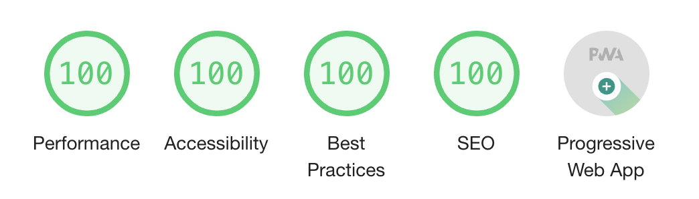

# LDD PWA

Lighthouse Development Driven PWA



## How to use this repository

You are seeing the latest revision. If you want to replay step by step, start back to the first commit and checkout each one consecutively.

## Step 1

Run Audit from Chrome.

### Automation

- Run Chrome Headless (prerequiste: install it!),
- Add an npm script to run audit,
- Add dev dependency in package.json,
- check that audit result is the same as visually running it in Chrome.
- parse JSON results... not quite easy... pwa.auditChecks.score?

## Step 2: Fix the first issue

"Does not respond with a 200 when offline"
"If you're building a Progressive Web App, consider using a service worker so that your app can work offline."

So we are going to add a basic [Service Worker]()!

1. Add a service worker to your app.
2. Use the service worker to cache files locally.
3. When offline, use the service worker as a network proxy to return the locally cached version of the file.

### Adding a Service Worker to our App

We need to add this to our index.html before our script that generates the UI:
```html
<script>
if('serviceWorker' in navigator) {
  navigator.serviceWorker
           .register('/sw.js')
           .then(function(registration) { console.log("Service Worker Registered with scope: " + registration.scope); })
           .catch(function(error) { console.log("Service Worker Registration failed with error: "+ error); });
}
</script>
```

It checks if the [current browser supports Service Workers](https://caniuse.com/#search=service%20worker).
Then it registers a `sw.js` file as the code for our Service Worker.
Then it logs some success string in the console.

Now we need to add the `ws.js` file:

We can:
- get inspiration from existing PWAs
- code it [from scratch]()
- use a Library like [Workbox](https://developers.google.com/web/tools/workbox/)
- copy paste from [Service Worker Cookbook](https://serviceworke.rs/)

We will do it from scratch:
```js
this.addEventListener('install', function(event) {
  event.waitUntil(
    caches.open('v1').then(function(cache) {
      return cache.addAll([
        '/index.html',
        '/',
      ]);
    })
  );
});

// SW intercepts "fetch" events, and as a Proxy can intercept a network request.
// thus we can use the cache to return cached stuff instead of making the request.
this.addEventListener('fetch', function(event) {
  event.respondWith(
    caches.match(event.request)
      .catch(function() {
        // if CACHE MISSES, then let the request pass.
        return fetch(event.request).
          then(function(response) {
            // And cache this new response
            return caches.open('v1').then(function(cache) {
              cache.put(event.request, response.clone());
              return response;
            });
          }).catch(function() {
            // if fetch is in error, we can here provide a default resource file.
            // TODO
          });
      })
  );
});
```


### HTTPS Server

But a Service Worker will not load on a browser unless it is served from HTTPS.
So we need to have our website served from HTTPS

Follow the [instructions on local-web-server wiki to have a Green Padlock on Chrome](https://github.com/lwsjs/local-web-server/wiki/How-to-get-the-%22green-padlock%22-using-the-built-in-certificate)
Please note that it will only work for localhost or 127.0.0.1 at the time of writing this file. See the [related Issue](https://github.com/lwsjs/local-web-server/issues/103)

We updated our npm script to use this method.

### PWA Score: 27 to 58!

Wow. Just Adding SSL/TLS and using a basic Service Worker that caches resources for offline usage bumped up our PWA score from 27 to 58.

## Step 3: fixing next issue, adding a Manifest

What is a [Manifest](https://developer.mozilla.org/docs/Web/Manifest)?

### Adding the manifest

In index.html:
```html
  <link rel="manifest" href="/manifest.webmanifest">
```

The manifest file itself:
```json
{
  "name": "LDD-PWA",
  "short_name": "LDDPWA",
  "start_url": "index.html?pwa=true",
  "display": "standalone",
  "background_color": "#f0f",
  "theme_color": "#f0f",
  "description": "From zero to hero PWA!",
  "icons": [{
    "src": "favicons/favicon-48.png",
    "sizes": "48x48",
    "type": "image/png"
  }, {
    "src": "favicons/favicon-72.png",
    "sizes": "72x72",
    "type": "image/png"
  }, {
    "src": "favicons/favicon-96.png",
    "sizes": "96x96",
    "type": "image/png"
  }, {
    "src": "favicons/favicon-144.png",
    "sizes": "144x144",
    "type": "image/png"
  }, {
    "src": "favicons/favicon-168.png",
    "sizes": "168x168",
    "type": "image/png"
  }, {
    "src": "favicons/favicon-192.png",
    "sizes": "192x192",
    "type": "image/png"
  }, {
    "src": "favicons/pwa-logo.png",
    "sizes": "512x512"
  }]
}
```
Then we restart our web server and run the Audit again.
We can also check on Application> Manifest in Chrome Dev Tools to see if the manifest is loaded.

We need to update the sw.js to include the icons to be cached, also.

### PWA Score: 58 to 73

- User can be prompted to install the app
- Configured custom splash screen
- the short_name won't be truncated on the homescreen

### Step 4: fixing viewport error & content size

"Does not have a <meta name="viewport"> tag with width or initial-scale"
Let's add this to our index.html
```html
<meta name="viewport" content="width=device-width, initial-scale=1">
```

Turns out it also fix another error: "Content is sized correctly for the viewport"

### PWA Score 73 to 85

### Step 6: meta theme-color

We'll add a meta theme-color to our index.html file:
```html
<meta name="theme-color" content="#f0f">
```

This earns us a few more points to our PWA Score (3 points).

### Step 5: noscript

"Does not provide fallback content when JavaScript is not available"

We will simply add a NOSCRIPT tag in our index.html:
```html
<noscript>JavaScript is required for this application to work.</noscript>
```

### Last step: redirecting HTTP to HTTPS

Now we need to redirect HTTP traffic to HTTPS.
This should be done at the web server level, with some redirect rule in an Apache/NGINX or IIS.

See [this issue for local-web-server](https://github.com/lwsjs/local-web-server/issues/86).
Just follow the instructions to use it in our project for development.

I will not (yet) go further on another HTTP server configuration & installation.
(for example, using Docker to have an NGINX linked to an Express server etc.)

### PWA 💯

With those last elements we hit the 100 mark.

To be sure, you have to use ports 80 and 443, so for my part, I had to do some port mapping.
My remote web server is on the cloud and I used SSH like this:
```
# on the remote, I launch `npm run start` which starts the HTTP server (which redirect to HTTPS) and the HTTPS server.
# then on the local server, I run those 2:
sudo ssh -i {path to my SSH key for remote server} -L localhost:80:127.0.0.1:8000 {remote_user_name}@{remote_machine_ip} -Nnt
sudo ssh -i {path to my SSH key for remote server} -L localhost:443:127.0.0.1:8443 {remote_user_name}@{remote_machine_ip} -Nnt
# then I open Chrome and go to http://localhost which gets redirected to https://localhost, and run the Lighthouse Audit
```

### Finishing touches

I added other things for SEO, Accessibility, etc.
Just look at the differences in the commit history.
I won't go into details because it is not related to obtaining the 100 score on PWA.

## Logo

From here: https://github.com/webmaxru/progressive-web-apps-logo/issues/4

## Favicons

http://favicons.fr/bfb48b598cc988e28990123d1cd81969.htm#Preview

